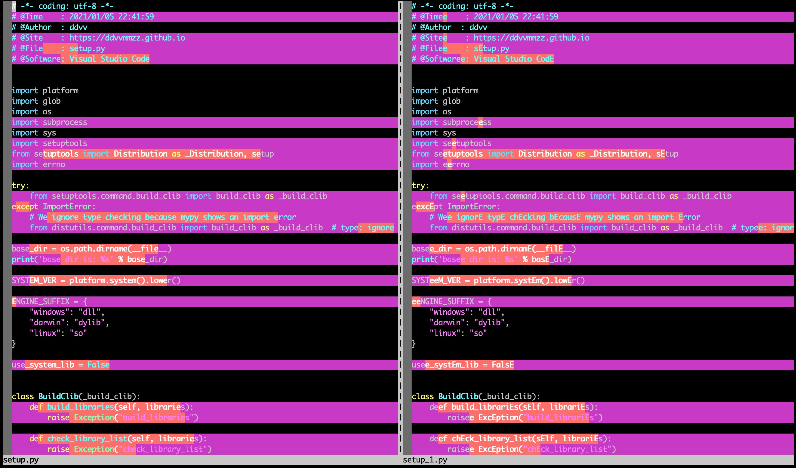
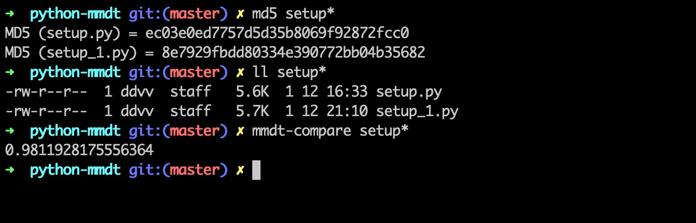
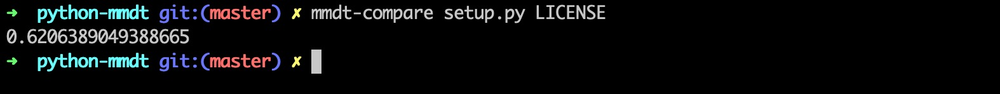

## 概述

`python_mmdt`是一种基于敏感哈希的特征向量生成工具。核心算法使用`C`实现，提高程序执行效率。同时使用`python`进行封装，方便研究人员使用。
本篇幅主要介绍涉及的相关基本内容与使用，相关内容的详细说明，后续详细探讨。

<!--more-->

## 重点内容

重点内容，包括三个方面：

1. 对象归一化：数据的重采样
2. 局部敏感哈希函数的定义：特征向量的生成
3. 特征向量的应用：距离计算、相似度计算、分类、聚类

## 重点假设

1. 数据的重采样方法**无条件**适用于研究对象，且重采样的过程会部分保留原始数据的差异性与相似性
2. 重采样之后的单个数据点（随机变量）是满足独立同分布的
3. N取值很大时，敏感哈希函数值分布近似于正态分布，则落在指定区间内的局部敏感哈希值是有效的

## 基本过程

### 1. 数据重采样

我们的研究对象常常是不同的文件格式，不同的文件大小，如何方便的处理这类格式不同，大小不一的文件呢？方法有很多种，这里我们使用采样的方法。

采样原始定义：

> 采样是将信号从连续时间域上的模拟信号转换到离散时间域上的离散信号的过程。

下采样定义：

> 对于一个样值序列间隔几个样值取样一次，这样得到新序列就是原序列的下采样。

通过重采样（本工具中特指下采样），我们让对象数据都处于相同的维度（大小）。这样，就可以比较方便地定义我们自己的局部敏感哈希函数。

`python_mmdt`使用Lanczos采样方法。


### 2. 局部敏感哈希函数

局部敏感哈希的基本概念

> 局部敏感哈希(Locality Sensitive Hashing，LSH)的基本思想类似于一种空间域转换思想，LSH算法基于一个假设，如果两个文本在原有的数据空间是相似的，那么分别经过哈希函数转换以后的它们也具有很高的相似度；相反，如果它们本身是不相似的，那么经过转换后它们应仍不具有相似性。

通过重采样之后的数据，我们假设其满足独立同分布。同时，我们将重采样的数据，平均分成N块，每块之间的数据进行累计求和，和值分布近似服从正态分布，我们取和值高x位的一个byte做为本块数据的敏感哈希值。

例如：

* `51030000:D6E26822530202020202020202020202`：`51030000`是4字节索引敏感哈希，`D6E26822530202020202020202020202`是16字节敏感哈希
* `4F454750:A4B58A07235B23F13B2F244A9B8A547B`：`4F454750`是4字节索引敏感哈希，`A4B58A07235B23F13B2F244A9B8A547B`是16字节敏感哈希

### 3. 特征向量的应用

#### 1. 简单应用

简单应用如，索引敏感哈希可以转成一个int32的数字，当索引敏感哈希相等时，再比较敏感哈希的距离（如曼哈顿距离，将敏感哈希转成N个`unsigned char`类型计算敏感哈希，此时`00`和`FF`之间的距离可算作1，也可算作255，具体看实现）。

#### 2. 复杂应用

由于特征向量的维度是固定的，因此可以很方便的使用其他数学方法，进行大规模计算。

* 如结合矩阵运算，快速得到上万特征向量（样本）的相似度矩阵，
* 如用于机器学习的分类（KNN）、聚类（Kmeans）等

## 安装

### 依赖

* `cmake`: 2.6及以上版本
* `windows`: 当前版本(0.0.3)安装需要配置`minGW`编译`C`代码

### pip安装

```
$ pip install python_mmdt
```

## 通过`whl`包安装（免编译）

`.whl` 从[`github_release`](https://github.com/a232319779/python_mmdt/releases)或者[`pypi`](https://pypi.org/project/python-mmdt/#files)下载编译好的二进制包安装

```
$ pip install python_mmdt-xxx.whl
```

## 使用

### 命令行

安装之后，可以通过命令行，快速计算敏感hash或比较两个文件相似度

```sh
# calculate mmdt sensitive
$ mmdt-hash $file_path

# calculate file similarity
$ mmdt-compare $file_path1 $file_path2
```

### python code

用作python库，导入编码使用

```python
# -*- coding: utf-8 -*-

import unittest
import os
from python_mmdt.mmdt.mmdt import MMDT


class Testmmdt(unittest.TestCase):
    def test_process(self):
        mmdt = MMDT()
        test_path = os.path.dirname(__file__)
        test_samples = os.path.join(test_path, "samples")
        files = os.listdir(test_samples)
        for f in files:
            file_path = os.path.join(test_samples, f)
            r1 = mmdt.mmdt_hash(file_path)
            print(r1)
            r2 = mmdt.mmdt_hash_streaming(file_path)
            print(r2)
            sim1 = mmdt.mmdt_compare(file_path, file_path)
            print(sim1)
            sim2 = mmdt.mmdt_compare_hash(r1, r2)
            print(sim2)
```

## 示例

拷贝一份当前项目的`setup.py`，命名为`setup_1.py`。

`setup_1.py`进行两种变换：

1. 使用大写字母`E`全局替换小写字母`e`
2. 使用`ee`全局替换大写字母`E`

计算`mmdt_hash`等于`0.9811928175556364`。

`vim`对比图如：



`md5`、`文件大小`、`mmdt_hash`信息图如：



## 其他

由于敏感哈希采用累计求和的方式，和值近似服从正态分布，所以由此计算出来的相似度，绝大部分会分布在u值附近区间内。在这块区间内的相似度，其实价值很低的。相反的，在这个区间外的，如正态分布的两侧数据，价值就很高了。相似度越高的表示真的越相似，相似度越低的表示真的越不相似。而落在中间取值范围，价值就小很多。

如比较项目中的`setup.py`和`LICENSE`，相似度`0.62`左右，但价值不大：


