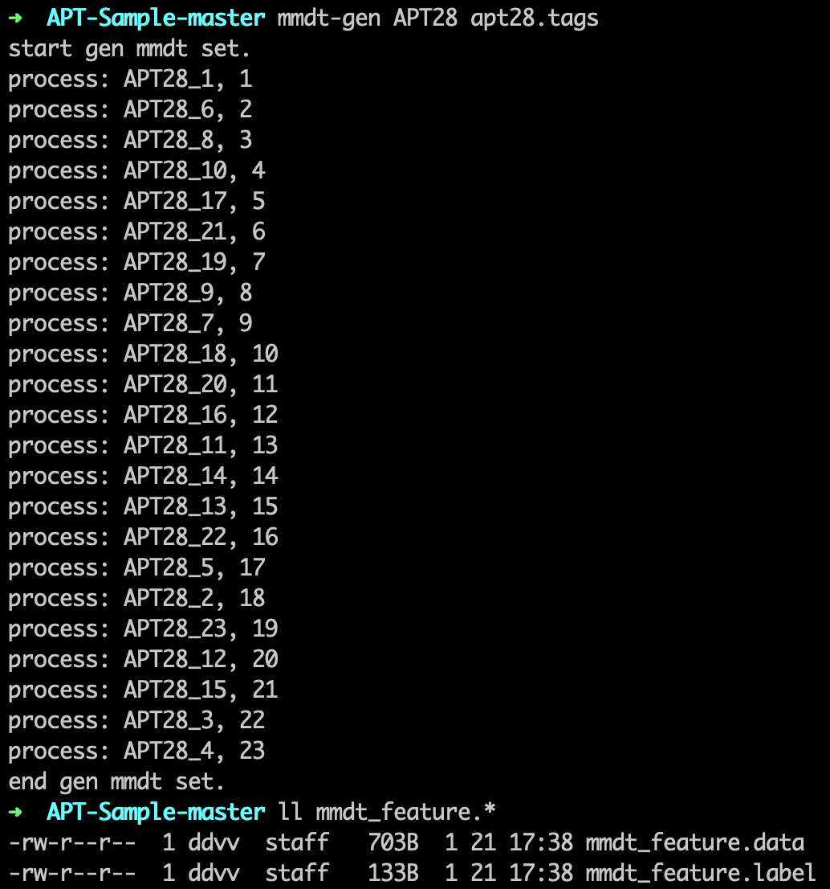
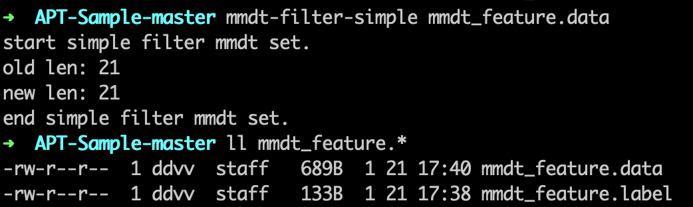
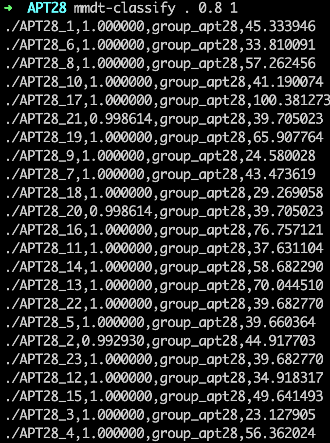

## 概述

上篇文章[python_mmdt:一种基于敏感哈希生成特征向量的python库(一)](https://ddvvmmzz.github.io/python_mmdt-%E4%B8%80%E7%A7%8D%E5%9F%BA%E4%BA%8E%E6%95%8F%E6%84%9F%E5%93%88%E5%B8%8C%E7%94%9F%E6%88%90%E7%89%B9%E5%BE%81%E5%90%91%E9%87%8F%E7%9A%84python%E5%BA%93(%E4%B8%80))我们介绍了一种叫`mmdt`的敏感哈希生成方法，并对其中的概念做了基本介绍。本篇，我们重点谈谈`mmdt`敏感哈希的分类应用场景。

<!--more-->

## 需求场景

设想这么一个需求：有一批文件需要判定是否属于恶意文件，并且需要给出恶意文件所属的家族类型。这个需求该怎么高效处理呢？处理过程又该怎么固化成我们自己的经验呢？当以后面临同样的需求时，能否复用之前的结果呢？

我能想到的做法有以下三种：

* 做法一：本地下载杀毒软件，使用杀毒软件对这批文件进行扫描，查看检测结果。
* 做法二：将这些文件上传到诸如Virustotal之类的检测平台，查看检测结果。
* 做法三：随机抽取样本分析，判定为恶意的，则提取yara规则，利用yara规则对剩余文件进行扫描，未扫出的文件继续人工分析，继续提yara规则，如此反复，直到处理完成。

针对以上三种做法，分别讨论其优点和缺点：

* 做法一：
  * 优点：处理方式简单快捷，误报率极低，处理效率高
  * 缺点：单一杀软漏报率可能较高；在Linux/MacOS上安装、使用杀软不方便；处理过程很难固化为经验；有可能导致文件泄漏（联网使用杀软云查可能导致文件被厂商收集）
* 做法二：
  * 优点：适用Windows/Linux/MacOS平台；检测误报率、漏报率都极低，结果丰富；处理效率高
  * 缺点：有联网要求；有一定的代码开发工作；文件百分百泄漏
* 做法三：
  * 优点：处理过程天然可固化为经验；适用任意平台；适用隔离网络；经验可积累，可复用；保证文件安全性
  * 缺点：工作量极大，处理效率极低；

需求场景可能太过定制化，但还是有一定的代表性的。针对以上的需求场景，`python_mmdt`工具的分类算法，可以很好的覆盖上。

使用`python_mmdt`做法，具有以下优点

* 处理方式简单、快捷、处理效率高
* 可打包为可执行文件，附带特征向量，跨平台适用Windows/Linux/MacOS
* 无联网要求，文件保密性高
* 处理过程可固化为经验，处理结果可无条件复用
* `mmdt`敏感哈希大小固定，存储占用空间小

当然，有两个缺点不能不提：

* 误报率可能较高（依赖于判定分值的设定）
* 漏报率可能较高（依赖于判定分值的设定）

## 代码项目地址

* [python_mmdt](https://github.com/a232319779/python_mmdt)
* 版本：0.1.3
* 特性：实现简单分类器，项目附带基础敏感哈希特征库，可实现恶意样本匹配

## 基本命令介绍

使用`pip`安装`python_mmdt`之后，会向系统中添加如下命令：

* mmdt-hash：计算指定文件的`mmdt_hash`值
* mmdt-std：计算`mmdt_hash`的标准差
* mmdt-compare：比较两个文件的`相似度`
* mmdt-gen：利用已知样本集，生成基于`mmdt_hash`的特征向量集合
* mmdt-filter：对生成的的特征向量集合，进行过滤，移除相通的特征向量
* mmdt-filter-simple：对生成的特征向量集，进行简单过滤（去重），适用与简单分类器
* mmdt-classify：对未知样本集进行分类处理，输出分类结果

## 基本命令使用

### 1. 计算文件的`mmdt_hash`

计算单个文件`mmdt_hash`值

* 输入参数1：文件路径
* 屏幕输出：`mmdt_hash`的值
* 文件输出：无

```sh
# ➜ mmdt-hash APT28_1
#   5D58573C:B39A90BCDCB4D491BEC74B207AE5FE39
$ mmdt-hash $file
```


### 2. 计算`mmdt_hash`的标准差

计算单个`mmdt_hash`值的标准差

* 输入参数1：单个`mmdt_hash`值
* 屏幕输出：`mmdt_hash`值的标准差
* 文件输出：无

```sh
# ➜ mmdt-std 5D58573C:B39A90BCDCB4D491BEC74B207AE5FE39
#   standard deviation: 45.333946
$ mmdt-std $mmdt_hash_str
```


### 3. 计算两个文件的相似度

计算两个文件的相似度，输入2个文件路径，输出

* 输入参数1：文件1路径
* 输入参数2：文件2路径
* 屏幕输出：两个文件的相似度
* 文件输出：无

```sh
# ➜ mmdt-compare APT28_1 APT28_2
#   0.9929302916167373
$ mmdt-compare $file1 $file2
```


### 4. 生成特征向量集合

生成基于mmdt_hash的特征向量集合

* 输入参数1：已知样本集的路径
* 输入参数2：已知样本集的标签文件路径
* 屏幕输出：生成特征向量过程信息
* 文件输出：当前文件夹生成两个文件，`mmdt_feature.label`和`mmdt_feature.data`

```sh
# ➜ mmdt-gen APT28 apt28.tags
#   ...
#   process: APT28_3, 22
#   process: APT28_4, 23
#   end gen mmdt set.
# ➜ ll mmdt_feature.*
#   -rw-r--r--  1 ddvv  staff   703B  1 16 10:34 mmdt_feature.data
#   -rw-r--r--  1 ddvv  staff   133B  1 16 10:34 mmdt_feature.label
$ mmdt-gen $file_path $file_tag
```



### 5. 特征向量过滤

对生成的特征向量集合进行过滤处理

* 输入参数1：特征向量集合文件
* 输入参数2：过滤条件的标准差下限
* 屏幕输出：过滤特征向量过程信息
* 文件输出：覆盖输入的**特征向量集合文件路径**

```sh
# ➜ mmdt-filter mmdt_feature.data 10.0
#   start filter mmdt set.
#   old len: 23
#   new len: 21
#   end filter mmdt set.
# ➜ ll mmdt_feature.*
#   -rw-r--r--  1 ddvv  staff   689B  1 16 10:39 mmdt_feature.data
#   -rw-r--r--  1 ddvv  staff   133B  1 16 10:34 mmdt_feature.label
$ mmdt-filter $mmdt_feature_file_name $dlt
```


### 6. 简单分类器特征向量过滤

对生成的基于`mmdt_hash`特征向量集合进行适配简单分类器(去重)过滤处理

* 输入参数1：特征向量集合文件
* 屏幕输出：过滤特征向量过程信息
* 文件输出：覆盖当前路径的`mmdt_feature.data`文件

```sh
# ➜ mmdt-filter-simple mmdt_feature.data
#   start filter mmdt set.
#   old len: 21
#   new len: 21
#   end filter mmdt set.
# ➜ ll mmdt_feature.*
#   -rw-r--r--  1 ddvv  staff   689B  1 16 10:39 mmdt_feature.data
#   -rw-r--r--  1 ddvv  staff   133B  1 16 10:34 mmdt_feature.label
$ mmdt-filter-simple $mmdt_feature_file_name
```



### 7. 分类器的使用

对指定文件或文件夹进行分类识别

* 输入参数1：目标文件路径或文件夹路径
* 输入参数2：相似度下限，可选，默认0.95
* 输入参数3：分类器类型，可选，默认1，简单分类器
* 屏幕输出：分类过程结果输出
* 文件输出：无

**重要**，需要将生成的`mmdt_feature.label`和`mmdt_feature.data`文件拷贝到`python_mmdt`的安装路径，命令如下：

* 拷贝特征向量集文件：`mmdt-copy mmdt_feature.data`
* 拷贝特征向量集对应标签文件：`mmdt-copy mmdt_feature.label`

特别注意：

* `mmdt_feature.label`和`mmdt_feature.data`文件名不可更改
* **当缺失`mmdt_feature.data`文件时，分类器默认是用`python_mmdt`的特征向量集**
* **当缺失`mmdt_feature.label`文件时，分类器仍可以工作，但是判定结果仅输出是否识别文件，而不会输出对应的判定标签**

```sh
# ➜ mmdt-classify . 0.8 1
#   ...
#   ./APT28_5,1.000000,group_apt28,39.660364
#   ./APT28_2,0.992930,group_apt28,44.917703
#   ./APT28_23,1.000000,group_apt28,39.682770
#   ...
# 注意：缺失mmdt_feature.label文件时，只会输出是否匹配，而不会输出对应标签
# ➜ mmdt-classify . 0.8 1
#   ...
#   ./APT28_5,1.000000,matched_0,39.660364
#   ./APT28_2,0.992930,matched_0,44.917703
#   ./APT28_23,1.000000,matched_0,39.682770
#   ...
$ mmdt-classify $file_or_path $sim_value $classify_type
```

