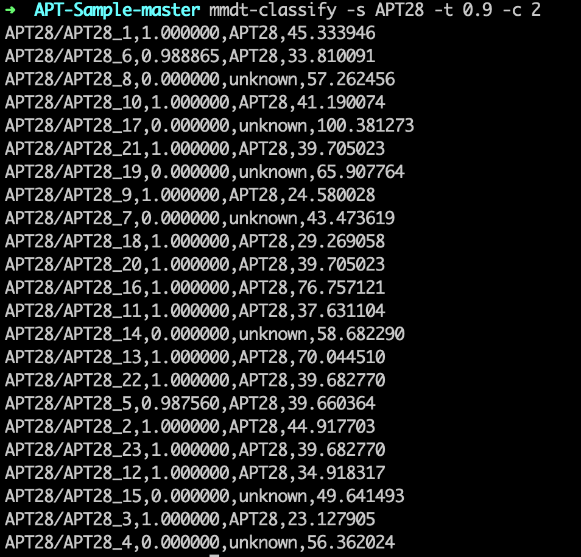

## 概述

* [python_mmdt:一种基于敏感哈希生成特征向量的python库(一)](https://ddvvmmzz.github.io/python_mmdt-%E4%B8%80%E7%A7%8D%E5%9F%BA%E4%BA%8E%E6%95%8F%E6%84%9F%E5%93%88%E5%B8%8C%E7%94%9F%E6%88%90%E7%89%B9%E5%BE%81%E5%90%91%E9%87%8F%E7%9A%84python%E5%BA%93(%E4%B8%80))我们介绍了一种叫`mmdt_hash`（敏感哈希）生成方法，并对其中的概念做了基本介绍。
* [python_mmdt:从0到1--实现简单恶意代码分类器(二)](https://ddvvmmzz.github.io/python_mmdt-%E4%BB%8E%E6%97%A0%E5%88%B0%E6%9C%89%E7%9A%84%E6%81%B6%E6%84%8F%E4%BB%A3%E7%A0%81%E5%88%86%E7%B1%BB%E5%99%A8(%E4%BA%8C))我们介绍了基于`mmdt_hash`的一种简单恶意代码分类器应用。
* 本篇，我们介绍一种基于`mmdt_hash`的机器学习算法应用--KNN（最邻近）分类算法

<!--more-->

## 基本概念

首先，我们一起简单回顾三个基本概念。

### 什么是机器学习？

> 机器学习是人工智能的一个分支。人工智能的研究历史有着一条从以“推理”为重点，到以“知识”为重点，再到以“学习”为重点的自然、清晰的脉络。显然，机器学习是实现人工智能的一个途径，即以机器学习为手段解决人工智能中的问题。机器学习在近30多年已发展为一门多领域交叉学科，涉及概率论、统计学、逼近论、凸分析、计算复杂性理论等多门学科。机器学习理论主要是设计和分析一些让计算机可以自动“学习”的算法。机器学习算法是一类从数据中自动分析获得规律，并利用规律对未知数据进行预测的算法。-- wikipedia

如上所诉，机器学习的本质是一种算法，这种算法由数据分析习得。当数据量充足时，机器学习方法所能得到的结果，可无限逼近于事物的本质面貌。

### 什么是监督学习？

> 监督学习（英语：Supervised learning），又叫有监督学习，监督式学习，是机器学习的一种方法，可以由训练资料中学到或建立一个模式（函数/learning model），并依此模式推测新的实例。训练资料是由输入物件（通常是向量）和预期输出所组成。函数的输出可以是一个连续的值（称为回归分析），或是预测一个分类标签（称作分类）。-- wikipedia

如上所诉，监督学习有三要素：（特征向量训练集，算法/模型，预测）。通过机器学习算法分析处理有标签的训练集，生成模型，利用模型处理无标签数据，输出预测结果。

### 什么是k-NN？

> 最近邻居法（k-NN算法，又译K-近邻算法）是一种用于分类和回归的非参数统计方法。在这两种情况下，输入包含特征空间（Feature Space）中的k个最接近的训练样本。
>
> * 在k-NN分类中，输出是一个分类族群。一个对象的分类是由其邻居的“多数表决”确定的，k个最近邻居（k为正整数，通常较小）中最常见的分类决定了赋予该对象的类别。若k=1，则该对象的类别直接由最近的一个节点赋予。
> * 在k-NN回归中，输出是该对象的属性值。该值是其k个最近邻居的值的平均值。
>
> 最近邻居法采用向量空间模型来分类，概念为相同类别的案例，彼此的相似度高，而可以借由计算与已知类别案例之相似度，来评估未知类别案例可能的分类。-- wikipedia

如上所诉，k-NN算法的核心思想是：一个样本与数据集中的k个样本最相似，如果这k个样本中的大多数属于某一个类别，则该样本也属于这个类别。

## 场景匹配

结合上文介绍，要在恶意代码检测场景中应用机器学习，至少需要准备两样东西：

* 1.有标签的训练集
* 2.算法/模型

### 1. 有标签的训练集

利用`python_mmdt`工具，我们处理一批已知标签的样本，生成对应的`mmdt_hash`值，`mmdt_hash`的每一个字节都是特征向量的一个维度。将这些值保存下来，既可作为`有标签的训练集`。（`mmdt_hash`的详细介绍，见之前两篇文章）

### 2. 算法/模型

提到机器学习，自然而然地会让人想到k-NN算法。k-NN算法具有明确的目标，清晰的流程，可读的结果，几乎可以认为是最简单有效的机器学习算法。k-NN算法通过计算两个特征向量之间的距离，评估两个特征向量之间的关联：距离越小，关联越大；距离越大，关联越小。

### 3.应用

容易得出，`mmdt_hash` + k-NN = machine_learning，`mmdt_hash`结合k-NN算法可作为某种机器学习应用。

## k-NN算法

### 1. 算法原理

k-NN核心思想：一个样本与数据集中的k个样本最相似，如果这k个样本中的大多数属于某一个类别，则该样本也属于这个类别。其中，通过距离来衡量相似度，距离越小，相似度越高；距离越大，相似度越低。而距离的度量，通常采用欧式距离。

### 2. 算法流程

k-NN算法流程如下：

1. 计算未知特征向量与训练集中每个特征向量的距离
2. 对距离的按远近排序
3. 选取与当前未知特征向量最近的k的已知特征向量，作为该未知特征向量的邻居
4. 统计这k个邻居的类别频率
5. k个邻居里频率最高的类别，即为未知特征向量的类别

## 基于k-NN的恶意代码检测实现

### 1.特征向量集生成

关键点两个：

1. 将已有的特征库转成knn需要的特征向量集形式
2. 保存knn特征向量集和对应标签索引集

```python
...

def gen_knn_features(self):
    data_list = []
    label_list = []
    # self.datas是已知特征库
    for data in self.datas:
        tmp = data.split(':')
        main_hash = tmp[1]
        main_values = []
        # 将字符串类型的mmdt_hash转成单条特征向量
        for i in range(0, len(main_hash), 2):
            main_values.append(int(main_hash[i:i+2], 16))
        # 保存knn需要的特征向量及标签索引
        data_list.append(main_values)
        label_list.append(int(tmp[2]))
    
    return data_list, label_list
...
```

### 2.k-NN算法实现

```python
...

def knn_classify(self, md, dlt):
    # 将mmdt_hash转为特征向量
    def gen_knn_data(data):
        tmp = data.split(':')
        main_hash = tmp[1]
        main_values = []
        for i in range(0, len(main_hash), 2):
            main_values.append(int(main_hash[i:i+2], 16))

        return main_values
    
    # 保存knn训练集和对应索引标签集
    datas = self.build_datas
    labels = self.build_labels
    
    train_datas = np.array(datas)
    t_data = gen_knn_data(md)
    rowSize = train_datas.shape[0]
    # 1.扩展未知特征标签维度，同时分别计算与knn特征向量集合的每个维度的差值，先平方求和再开方，即为欧式距离
    diff = np.tile(t_data, (rowSize, 1)) - train_datas
    sqr_diff = diff ** 2
    sqr_diff_sum = sqr_diff.sum(axis=1)
    distances = sqr_diff_sum ** 0.5
    # 2. 对距离排序
    sort_distance = distances.argsort()
    
    # 3. 使用最近一个邻居
    matched = sort_distance[0]

    # 4. 使用最近一个邻居的标签作为判定标签
    label_index = labels[matched]
    sim = 1.0 - distances[matched]/1020.0
    # 5. 判定相似度是否满足指定条件
    if sim > dlt:
        if self.labels:
            label = self.labels[label_index]
        else:
            label = 'match_%d' % label_index
        return sim, label
    return 0.0, 'unknown'
...
```

## 使用帮助

```
➜ mmdt-classify -h
usage: python_mmdt malicious file scan tool [-h] [-s SCANS] [-t THRESHOLD]
                                            [-c CLASSIFY_TYPE]

A malicious scanner tool based on mmdt_hash. Version 0.2.1

optional arguments:
  -h, --help            show this help message and exit
  -s SCANS, --scans SCANS
                        set file/path to scan.
  -t THRESHOLD, --threshold THRESHOLD
                        set threshold value to determine whether the file is a
                        malicious file. (default 0.95)
  -c CLASSIFY_TYPE, --classify CLASSIFY_TYPE
                        set classify type.set 1 for simple classify, set 2 for
                        knn classify.(default 1)

Use like:
    1. use simple classify
    mmdt-classify -s $sample_path -t 0.95 -c 1
    2. use knn classify
    mmdt-classify -s $sample_path -t 0.95 -c 2

```

## 效果截图

