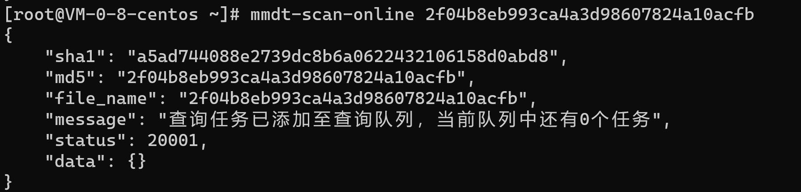
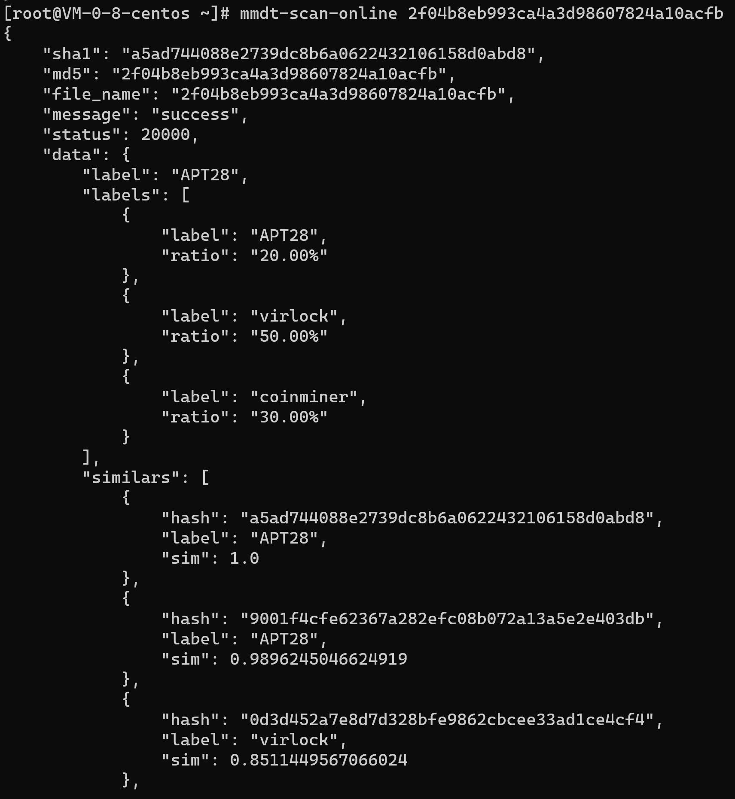

## 概述

* [python_mmdt:一种基于敏感哈希生成特征向量的python库(一)](https://ddvvmmzz.github.io/python_mmdt-%E4%B8%80%E7%A7%8D%E5%9F%BA%E4%BA%8E%E6%95%8F%E6%84%9F%E5%93%88%E5%B8%8C%E7%94%9F%E6%88%90%E7%89%B9%E5%BE%81%E5%90%91%E9%87%8F%E7%9A%84python%E5%BA%93(%E4%B8%80))我们介绍了一种叫`mmdt_hash`（敏感哈希）生成方法，并对其中的概念做了基本介绍。
* [python_mmdt:从0到1--实现简单恶意代码分类器(二)](https://ddvvmmzz.github.io/python_mmdt-%E4%BB%8E%E6%97%A0%E5%88%B0%E6%9C%89%E7%9A%84%E6%81%B6%E6%84%8F%E4%BB%A3%E7%A0%81%E5%88%86%E7%B1%BB%E5%99%A8(%E4%BA%8C))我们介绍了基于`mmdt_hash`的一种简单恶意代码分类器应用。
* [python_mmdt:从1到2--实现基于KNN的机器学习恶意代码分类器(三)](https://ddvvmmzz.github.io/python_mmdt-%E4%BB%8E1%E5%88%B02-%E5%AE%9E%E7%8E%B0%E5%9F%BA%E4%BA%8EKNN%E7%9A%84%E6%9C%BA%E5%99%A8%E5%AD%A6%E4%B9%A0%E6%81%B6%E6%84%8F%E4%BB%A3%E7%A0%81%E5%88%86%E7%B1%BB%E5%99%A8(%E4%B8%89))我们介绍基于`mmdt_hash`的机器学习恶意代码分类器应用。
* 本篇，我们介绍如何使用`mmdt_hash`实现在线恶意文件检测

<!--more-->

## 项目地址

* github代码地址：[python_mmdt](https://github.com/a232319779/python_mmdt)
* pypi包地址：[python_mmdt](https://pypi.org/project/python-mmdt/)

## 安装方法

### Linux

使用`pip`进行安装，安装命令：`pip install python_mmdt`

### Windows

建议使用`.whl`发行包进行安装，发行包下载地址：

* 1. github: [0.3.1版本—-download](https://github.com/a232319779/python_mmdt/releases/download/0.3.1/python_mmdt-0.3.1-cp38-cp38-win_amd64.whl)
* 2. pypi: [0.3.1版本—-download](https://files.pythonhosted.org/packages/82/6d/9e1d7816465b43ff9c135abcea31255d6a155d9b754b0f63a271e3e766af/python_mmdt-0.3.1-cp38-cp38-win_amd64.whl)

安装命令：`pip install python_mmdt-0.3.1-cp38-cp38-win_amd64.whl`

### MacOS

* 1. 安装`cmake`，安装命令：`brew install cmake`
* 2. 使用`pip`安装，安装命令：`pip install python_mmdt`

## 使用说明

### 命令行快捷使用

`pip install python_mmdt`命令安装成功之后，系统会添加`mmdt-scan-online`命令，使用`mmdt-scan-online`可快速实现在线扫描，如下所示：

```sh
# 第一次执行会提交任务，并返回任务状态
[root@VM-0-8-centos ~]# mmdt-scan-online 2f04b8eb993ca4a3d98607824a10acfb
{
    "sha1": "a5ad744088e2739dc8b6a0622432106158d0abd8",
    "md5": "2f04b8eb993ca4a3d98607824a10acfb",
    "file_name": "2f04b8eb993ca4a3d98607824a10acfb",
    "message": "查询任务已添加至查询队列，当前队列中还有0个任务",
    "status": 20001,
    "data": {}
}

# 第二次执行会获取任务结果，返回10个最相似文件的标签及其sha1
[root@VM-0-8-centos ~]# mmdt-scan-online 2f04b8eb993ca4a3d98607824a10acfb
{
    "sha1": "a5ad744088e2739dc8b6a0622432106158d0abd8",
    "md5": "2f04b8eb993ca4a3d98607824a10acfb",
    "file_name": "2f04b8eb993ca4a3d98607824a10acfb",
    "message": "success",
    "status": 20000,
    "data": {
        "label": "APT28",
        "labels": [
            {
                "label": "APT28",
                "ratio": "20.00%"
            },
            {
                "label": "virlock",
                "ratio": "50.00%"
            },
            {
                "label": "coinminer",
                "ratio": "30.00%"
            }
        ],
        "similars": [
            {
                "hash": "a5ad744088e2739dc8b6a0622432106158d0abd8",
                "label": "APT28",
                "sim": 1.0
            },
            {
                "hash": "9001f4cfe62367a282efc08b072a13a5e2e403db",
                "label": "APT28",
                "sim": 0.9896245046624919
            },
            {
                "hash": "0d3d452a7e8d7d328bfe9862cbcee33ad1ce4cf4",
                "label": "virlock",
                "sim": 0.8511449567066024
            },
            {
                "hash": "740d644a48ac474bb5274cfe064f2205ef3b11e5",
                "label": "coinminer",
                "sim": 0.8418344542282326
            },
            ...
        ]
    }
}
```

### 开发使用

`pip install python_mmdt`命令安装成功以后，可按如下示例代码使用`python_mmdt`库实现在线扫描：

```python
# -*- coding: utf-8 -*-
import sys
import json
import requests
from python_mmdt.mmdt.common import gen_md5, gen_sha1
from python_mmdt.mmdt.mmdt import MMDT


def mmdt_scan_online():
    # 构造mmdt对象
    mmdt = MMDT()
    # 命令行参数
    file_name = sys.argv[1]
    # 计算文件md5、sha1、mmdt
    file_md5 = gen_md5(file_name)
    file_sha1 = gen_sha1(file_name)
    file_mmdt = mmdt.mmdt_hash(file_name)
    data = {
        "md5": file_md5,
        "sha1": file_sha1,
        "file_name": file_name,
        "mmdt": file_mmdt,
        "data": {}
    }
    # 提交数据，获取结果
    r = requests.post(url='http://146.56.242.184/mmdt/scan', json=data)
    r_data = r.json()
    print(json.dumps(r_data, indent=4, ensure_ascii=False))


def main():
    mmdt_scan_online()


if __name__ == '__main__':
    main()

```

## 特别的

1. **本工具不收集任何文件，不用担心文件泄露，当前仅上传必须的基本信息，包括5个字段：**
    * `文件md5`：必须
    * `文件sha1`：必须
    * `文件名称file_name`：必须
    * `文件敏感哈希mmdt`：必须
    * `扩展字段data`：可选
2. 上传信息与结果获取使用同一个web api接口：`/mmdt/scan`：
    * 若上传文件哈希不在缓存中，则提交至任务队列，后台进行检测，检测完成后将结果写入缓存
    * 若上传文件哈希在缓存中，则直接返回检测结果
3. 返回结果字段说明：
    * 若上传文件哈希不在缓存中，则返回任务状态信息，主要包括当前任务在队列中的排号及任务状态（详情查看`message`字段）
    * 若上传文件哈希在缓存中，则返回检测结果，检测结果在`data`字段，`lable`字段为最相似样本的标签，`labels`字段为最相似10个样本的标签统计，`similars`字段为最相似样本的信息，包括`文件哈希`、`文件标签`、`文件相似度`这3个字段
4. **后台使用KNN机器学习算法，实现`mmdt`哈希的相似匹配**
5. 当前后端收集的恶意文件`mmdt`哈希文件大小在23M左右
6. **匹配效果好的文件类型为二进制文件，如`PE`、`ELF`、`pdf`、`rtf`等**
7. 匹配效果差的文件类型为压缩包文件，如`apk`、`docx`、`zip`、`rar`等，后续需要调整为解包检测

## 示例截图

### 提交任务



### 获取结果

