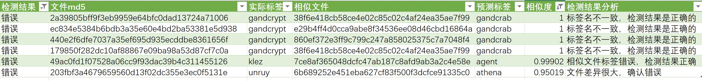
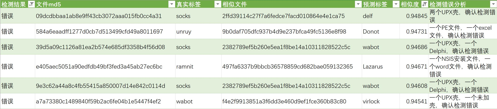

## 概述

* [python_mmdt:一种基于敏感哈希生成特征向量的python库(一)](https://ddvvmmzz.github.io/python_mmdt-%E4%B8%80%E7%A7%8D%E5%9F%BA%E4%BA%8E%E6%95%8F%E6%84%9F%E5%93%88%E5%B8%8C%E7%94%9F%E6%88%90%E7%89%B9%E5%BE%81%E5%90%91%E9%87%8F%E7%9A%84python%E5%BA%93(%E4%B8%80))我们介绍了一种叫`mmdthash`（敏感哈希）生成方法，并对其中的概念做了基本介绍。
* [python_mmdt:从0到1--实现简单恶意代码分类器(二)](https://ddvvmmzz.github.io/python_mmdt-%E4%BB%8E%E6%97%A0%E5%88%B0%E6%9C%89%E7%9A%84%E6%81%B6%E6%84%8F%E4%BB%A3%E7%A0%81%E5%88%86%E7%B1%BB%E5%99%A8(%E4%BA%8C))我们介绍了基于`mmdthash`的一种简单恶意代码分类器应用。
* [python_mmdt:从1到2--实现基于KNN的机器学习恶意代码分类器(三)](https://ddvvmmzz.github.io/python_mmdt-%E4%BB%8E1%E5%88%B02-%E5%AE%9E%E7%8E%B0%E5%9F%BA%E4%BA%8EKNN%E7%9A%84%E6%9C%BA%E5%99%A8%E5%AD%A6%E4%B9%A0%E6%81%B6%E6%84%8F%E4%BB%A3%E7%A0%81%E5%88%86%E7%B1%BB%E5%99%A8(%E4%B8%89))我们介绍基于`mmdthash`的机器学习恶意代码分类器应用。
* [python_mmdt:mmdthash的在线使用(四)](https://ddvvmmzz.github.io/python_mmdt_mmdthash%E7%9A%84%E5%9C%A8%E7%BA%BF%E4%BD%BF%E7%94%A8(%E5%9B%9B))我们介绍如何使用`mmdthash`实现在线恶意文件检测。
* 本篇，我们对基于KNN机器学习算法的分类结果进行统计测试，评估分类模型。

<!--more-->

## 评估结论

1. KNN模型共计632253条`mmdthash`，覆盖1150个恶意家族标签
2. 基于KNN模型的多分类结果，`准确率ACC`达到80%以上，`召回率REC`达到60%以上
3. 相似度判定阈值可按0.95划分：相似度不低于0.95，判定结果极大可信（`精确率PRE`达到100%）；低于0.95的结果可信度逐步降低
4. 相似度阈值设定为0.95时，KNN模型没有发现误报

## 项目信息

* github代码地址：[python_mmdt](https://github.com/a232319779/python_mmdt)

## KNN模型结果分析

### 基本信息

* KNN模型信息：共计632253条`mmdthash`记录，覆盖1150个恶意家族标签，其中二进制文件占比超90%。
* 测试文件集信息：任意挑选200个黑文件（不在KNN模型中）和200个白文件，共计400个，95%以上为二进制文件。其中200个黑文件覆盖58个恶意家族，加上1个干净文件家族，共计59个家族分类。
* 测试方法说明：使用400个测试文件，通过web（http://146.56.242.184/mmdt/scan ）接口，获取KNN模型给出的最相似样本及信息，结合相似度判定（阈值判定），对比预测标签与实际标签，统计`准确率ACC`、`精确率PRE`与`召回率REC`，从而判定基于`mmdthash`的KNN模型的效果。

### KNN模型信息

* KNN模型名称: mmdt_feature_20220120.data
* KNN模型大小：23M
* `mmdthash`特征数量: 632253条
* 恶意家族数量：1150个

**KNN模型家族Top10列表**

|恶意家族标签|恶意样本数量|恶意样本占比|
|----|----|----|
|virlock|169631|26.83%|
|botnet|168238|26.61%|
|gandcrab|76101|12.04%|
|wabot|47340|7.49%|
|pluto|28554|4.52%|
|coinminer|19226|3.04%|
|autorun|17681|2.80%|
|virut|8012|1.27%|
|gandcrypt|7210|1.14%|
|upatre|6717|1.06%|
|总计|548710|86.79%|

### 测试文件集信息

* 测试数据集名称：mmdt_feature_test_400.data
* 测试集文件大小：21K
* 测试数据集下载地址: [download](https://github.com/ddvvmmzz/ddvvmmzz.github.io/blob/master/datas/python_mmdt/5/mmdt_feature_test_400.data)
* `mmdthash`特征数量: 400
* 分类家族数量：59

**测试集家族Top10列表**

|家族标签|样本数量|样本占比|
|----|----|----|
|clean|200|50.00%|
|gandcrypt|14|3.50%|
|upatre|13|3.25%|
|ipamor|11|2.75%|
|wabot|11|2.75%|
|pluto|9|2.25%|
|autoit|9|2.25%|
|virut|8|2.00%|
|allaple|8|2.00%|
|sytro|6|1.50%|
|总计|289|72.25%|

### 测试方法

1. 使用`python_mmdt`库，编码对400个文件进行`mmdthash`计算，生成测试数据集`mmdt_feature_test_400.data`；
2. 使用`python_mmdt`库，编码请求web服务，对400条测试数据集进行KNN模型分类；
3. 统计KNN模型分类结果，统计维度为`TP`、`TN`、`FP`、`FN`，计算维度包括`准确率ACC`、`精确率PRE`、`召回率REC`：
    * `TP`表示实际标签为真（恶意），预测标签为真（恶意）的数目
    * `TN`表示实际标签为假（干净），预测标签为假（干净）的数目
    * `FP`表示实际标签为假（干净），预测标签为真（恶意）的数目
    * `FN`表示实际标签为真（恶意），预测标签为假（干净）的数目
    * `准确率ACC`表示所有预测标签正确的数量占比（可以理解为KNN模型的检出率），计算公式为：`ACC = (TP + TN)/(TP + TN + FP + FN)`
    * `精确率PRE`表示所有实际为真（恶意）的数量在预测为真（恶意）的占比（可以理解为KNN模型对检测的恶意样本的结果可信度），计算公式为：`PRE = TP/(TP + FP)`
    * `召回率REC`表示所有预测为真（恶意）的数量在实际为真（恶意）的占比（可以理解为KNN模型对恶意样本的检出覆盖能力），计算公式为：`REC = TP/(TP + FN)`

**判定依据：**
1. **`准确率ACC`衡量了分类器的效果，`准确率ACC`越高，分类器效果越好；**
2. **`精确率PRE`衡量了分类器对真例（恶意）的检出正确率，`精确率PRE`越高，对真例（恶意）的检出正确率越高，模型可信度越高；**
3. **`召回率REC`衡量了分类器对真例（恶意）的检出查全率，`召回率REC`越高，对真例（恶意）的检出查全率越高，模型检出覆盖能力越高。**

**特别说明：**
1. **本次统计测试中，相似度取两个阈值进行对比，大于0.95（和0.90），则才判定为真（恶意）；否则判定为假（干净）。**
2. **KNN模型、测试文件集都是多标签的，在实际使用中等价于多分类，所以本次统计测试中，在判定为恶意的前提下，还需要预测标签与实际标签一致，才可判定为TP。此种情况下统计出的准确率、精确率、召回率等会低于二分类（非白即黑）的统计情况。**

### 测试代码

```python
# -*- coding: utf-8 -*-
import sys
import requests
from python_mmdt.mmdt.common import mmdt_load

# 相似度判定阈值，阈值取两个，0.95和0.90
dlt = 0.95

def mmdt_scan_online_check():
    file_name = sys.argv[1]
    # 加载测试数据
    features = mmdt_load(file_name)
    # 4个指标项
    TP = 0
    TN = 0
    FP = 0
    FN = 0
    count = 0
    print('检测结果,文件md5,真实标签,相似文件,预测标签,相似度')
    for feature in features:
        count += 1
        tmp = feature.strip().split(":")
        file_mmdt = ':'.join(tmp[:2])
        tag = tmp[2]
        file_sha1 = tmp[3]
        data = {
            "md5": file_sha1,
            "sha1": file_sha1,
            "file_name": file_sha1,
            "mmdt": file_mmdt,
            "data": {}
        }
        r = requests.post(url='http://146.56.242.184/mmdt/scan', json=data)
        r_data = r.json()
        if r_data.get('status', 0) == 20001:
            status = r_data.get('status', 0)
            message = r_data.get('message', '')
            print('文件md5: %s, 状态码: %d, 提交信息: %s' % (file_sha1, status, message))
        else:
            label = r_data.get('data', {}).get('label', 'unknown')
            sim_hash = r_data.get('data', {}).get('similars', [])[0].get('hash', 'None')
            sim = r_data.get('data', {}).get('similars', [])[0].get('sim', 0.0)
            check_result = ''
            # 统计隐藏条件，实际标签与预测标签一致，才可判定为TP，记为正确分类
            if tag == label and sim > dlt:
                TP += 1
                check_result = '正确'
            elif tag == 'clean' and sim > dlt:
                FP += 1
                check_result = '错误'
            elif tag == 'clean' and sim <= dlt:
                TN += 1
                check_result = '正确'
            else:
                FN += 1
                check_result = '错误'
            print('%s,%s,%s,%s,%s,%.5f' % (check_result, file_sha1, tag, sim_hash, label, sim))
        if count >= 500:
            break
    print('测试mmdthash总数：%d' % count)
    print('检测正确总数：%d' % (TP + TN))
    print('检测错误总数：%d' % (FP + FN))
    print('检测TP总数：%d' % TP)
    print('检测TN总数：%d' % TN)
    print('检测FP总数：%d' % FP)
    print('检测FN总数：%d' % FN)
    print('检测准确率ACC：%.3f' % ((TP + TN)/(TP + TN + FP + FN)))
    print('检测精确率PRE：%.3f' % (TP/(TP + FP)))
    print('检测召回率REC：%.3f' % (TP/(TP + FN)))


def main():
    mmdt_scan_online_check()


if __name__ == '__main__':
    main()
```

### 测试结果如下

|指标名称|0.95指标|0.90指标|
|----|----|----|
|mmdthash总数|400|400|
|检测正确总数|327|326|
|检测错误总数|73|74|
|TP|127|137|
|TN|200|189|
|FP|0|11|
|FN|73|63|
|准确率ACC|0.818|0.815|
|精确率PRE|1.000|0.923|
|召回率REC|0.635|0.685|

结论如下：

* 当前分类器检测的`准确率ACC`高于80%，`召回率REC`高于60%
* 0.95指标下的`准确率ACC`比0.90指标下的`准确率ACC`提升了3.68‰，`准确率ACC`达到81.8%
* 0.95指标下的`精确率PRE`比0.90指标下的`精确率PRE`提升了83.42‰，`精确率PRE`达到100%
* 0.95指标下的`召回率REC`比0.90指标下的`召回率REC`降低了72.99‰，`召回率REC`达到63.5%
* 0.95指标下，没有发现存在误报（FP=0）
* **综合衡量，0.95可设定为初始判定阈值：不低于0.95的判定结果可初步判定为可信；低于0.95的判定结果可初步判定为不可信**

### 分类错误样本抽样分析

**0.95错误样本抽样分析**



* 相似度等于1的错误：`gandcrypt`和`gandcrab`属于同一个恶意家族的不同名称，相似度等于1的此类检测结果属于正确的
* 相似度大于0.99，小于1的错误：由于`agent`样本的标签错误导致，通过VT查询，`agent`样本实际也为`klez`，检测结果正确。
* 相似度大于0.95，小于0.99的错误：两个文件差异很大，`mmdthash`问题，确认检测结果错误

**0.90错误样本抽样分析**


* 相似度大于0.95的错误：同0.95阈值的分类错误
* 相似度大于0.94，小于0.95的错误：检测结果确认全部错误，如将UPX壳的文件和Delphi编译文件关联，将NSIS文件和word文件关联，将PE文件和excel文件关联
* 相似度低于0.94的错误：错误原因很多，但也包含部分正确结果

### 备注

1. 后续可以扩展KNN模型中的`mmdthash`数量，再进行测试
2. 在分析检测测试结果时，发现某些特定家族或者特定时期的样本，计算得到的`mmdthash`并没有差异，从而导致KNN得出的最相似样本几乎是固定不变的。在这种情况下，可以考虑对基础库数据进行过滤，减少数量，减小体积，优化查询速度以及减少内存占用等。