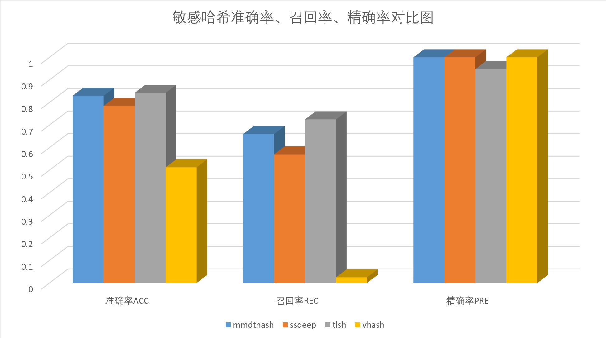
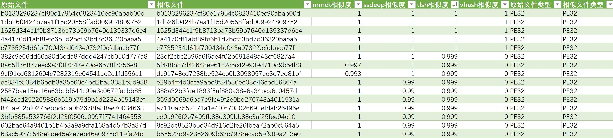
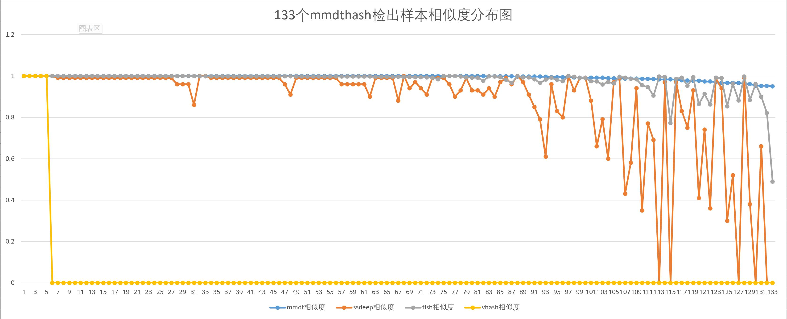
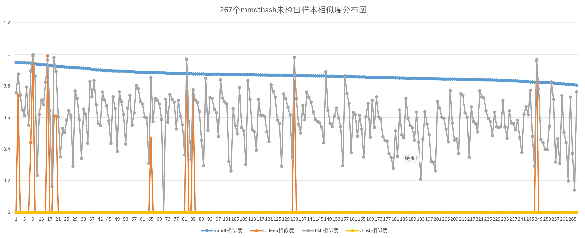
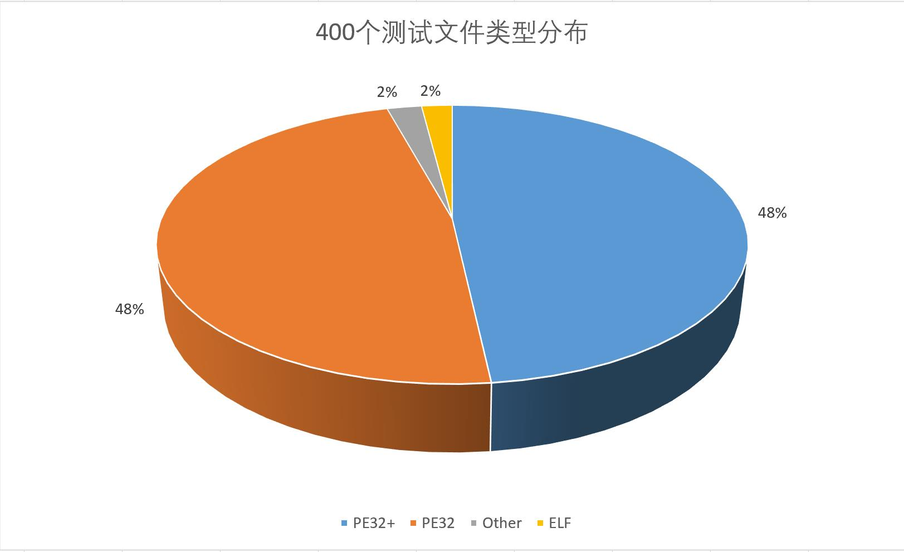
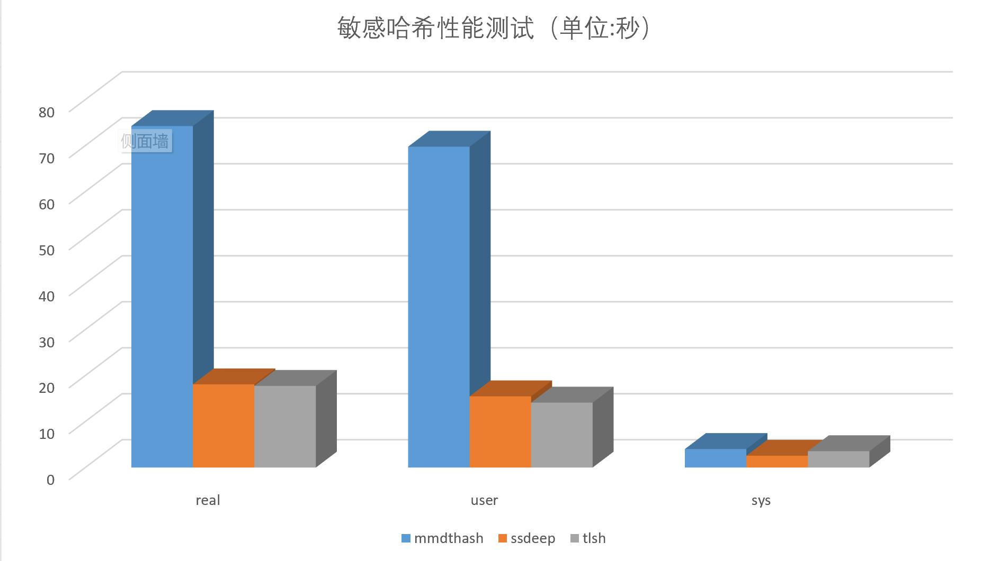

## 前文回顾

* [python_mmdt:一种基于敏感哈希生成特征向量的python库(一)](https://ddvvmmzz.github.io/python_mmdt-%E4%B8%80%E7%A7%8D%E5%9F%BA%E4%BA%8E%E6%95%8F%E6%84%9F%E5%93%88%E5%B8%8C%E7%94%9F%E6%88%90%E7%89%B9%E5%BE%81%E5%90%91%E9%87%8F%E7%9A%84python%E5%BA%93(%E4%B8%80))我们介绍了一种叫`mmdthash`（敏感哈希）生成方法，并对其中的概念做了基本介绍。
* [python_mmdt:从0到1--实现简单恶意代码分类器(二)](https://ddvvmmzz.github.io/python_mmdt-%E4%BB%8E%E6%97%A0%E5%88%B0%E6%9C%89%E7%9A%84%E6%81%B6%E6%84%8F%E4%BB%A3%E7%A0%81%E5%88%86%E7%B1%BB%E5%99%A8(%E4%BA%8C))我们介绍了基于`mmdthash`的一种简单恶意代码分类器应用。
* [python_mmdt:从1到2--实现基于KNN的机器学习恶意代码分类器(三)](https://ddvvmmzz.github.io/python_mmdt-%E4%BB%8E1%E5%88%B02-%E5%AE%9E%E7%8E%B0%E5%9F%BA%E4%BA%8EKNN%E7%9A%84%E6%9C%BA%E5%99%A8%E5%AD%A6%E4%B9%A0%E6%81%B6%E6%84%8F%E4%BB%A3%E7%A0%81%E5%88%86%E7%B1%BB%E5%99%A8(%E4%B8%89))我们介绍基于`mmdthash`的机器学习恶意代码分类器应用。
* [python_mmdt:mmdthash的在线使用(四)](https://ddvvmmzz.github.io/python_mmdt_mmdthash%E7%9A%84%E5%9C%A8%E7%BA%BF%E4%BD%BF%E7%94%A8(%E5%9B%9B))我们介绍如何使用`mmdthash`实现在线恶意文件检测。
* [python_mmdt:KNN机器学习分类结果测试分析(五)](https://ddvvmmzz.github.io/python_mmdt_KNN%E6%9C%BA%E5%99%A8%E5%AD%A6%E4%B9%A0%E5%88%86%E7%B1%BB%E7%BB%93%E6%9E%9C%E6%B5%8B%E8%AF%95%E5%88%86%E6%9E%90(%E4%BA%94))我们对基于KNN机器学习算法的分类结果进行统计测试，评估分类模型。
* 本篇，我们对`ssdeep`、`tlsh`、`vhash`、`mmdthash`这四类敏感哈希算法效果进行对比

<!--more-->

## 项目地址

* github代码地址：[python_mmdt](https://github.com/a232319779/python_mmdt)

## 结论

* 准确率ACC：`tlsh` > `mmdthash` > `ssdeep` > `vhash`
* 召回率REC：`tlsh` > `mmdthash` > `ssdeep` > `vhash`
* 精确率PRE：`mmdthash` = `ssdeep` = `vhash` > `tlsh`



基于本篇的测试结果，在`mmdthash`阈值取0.95，`ssdeep`阈值取0.8，`tlsh`阈值取0.8的前提下，敏感哈希效果的综合排序如下：

**`tlsh` > `mmdthash` > `ssdeep` > `vhash`**

## 敏感哈希介绍

四类敏感哈希一览：

* [CTPH(ssdeep)](https://ssdeep-project.github.io/ssdeep/index.html)：context triggered piecewise hashes(CTPH)，又叫模糊哈希，最早由Jesse Kornblum博士在2006年提出，论文地址点击[这里](https://ssdeep-project.github.io/ssdeep/index.html)。CTPH可用于文件/数据的**同源性判定**，据官方文档介绍，其计算速度是`tlsh`的两倍（测试了一下，好像并没有）。
* [tlsh](https://tlsh.org/index.html)：是趋势科技开源的一款模糊哈希计算工具，将50字节以上的数据计算生成一个哈希值，通过计算哈希值之间的相似度，从而得到原始文件之间的同源性关联。据官方文档介绍，`tlsh`比`ssdeep`和`sdhash`等其他模糊哈希算法更难攻击和绕过。
* [vhash](https://developers.virustotal.com/reference/files)：（翻遍了整个virustotal的文档，就找到这么一句话）“an in-house similarity clustering algorithm value, based on a simple structural feature hash allows you to find similar files”，大概就是说是个内部相似性聚类算法，允许你通过这个简单的值，找到相似的样本。
* [mmdthash](https://github.com/a232319779/python_mmdt)：是个人开源的一款模糊哈希计算工具，将任意数据计算生成一个模糊哈希值，通过计算模糊哈希值之间的相似度，从而判断两个文件之间的关联性。详情前文1-5篇。

## 对比思路

基于上篇文章中的`mmdthash`测试数据及测试结果，对`ssdeep`、`tlsh`、`vhash`进行对比测试。即计算`mmdthash`关联出的两个样本之间的`ssdeep`、`tlsh`、`vhash`相似度，并统计分析相关的异常值，从而得出敏感哈希算法之间的对比结果。

## 对比过程

说明：`ssdeep`和`tlsh`在windows上的安装比较折腾，测试直接在树莓派的linux环境上进行。

### 1. ssdeep计算

ssdeep安装：

1. 安装模糊哈希库：`sudo apt-get -y install libfuzzy-dev ssdeep`
2. 安装`ssdeep`的python库：`pip install ssdeep`

或者，如果linux的编译环境比较全（包含automake等工具），可以直接通过`pip`安装`ssdeep`的模糊哈希库：`BUILD_LIB=1 pip install ssdeep`

利用python的`ssdeep`库计算785个测试文件的`ssdeep`值，并使用`json`格式保存在文件中，代码如下：

```python
# -*- coding: utf-8 -*-

import os
import sys
import hashlib
import json
import ssdeep

# 遍历目录
def list_dir(root_dir):
    files = os.listdir(root_dir)
    for f in files:
        file_path = os.path.join(root_dir, f)
        yield file_path

# 生成sha1
def gen_sha1(file_name):
    with open(file_name, 'rb') as f:
        s = f.read()
        _s = hashlib.sha1()
        _s.update(s)
        return _s.hexdigest()

def main():
    # 输入785个文件的路径
    file_path = sys.argv[1]
    ssdeep_dict = dict()
    for file_name in list_dir(file_path):
        file_sha1 = gen_sha1(file_name)
        ssdeep_hash = ssdeep.hash_from_file(file_name)
        print('%s,%s' % (file_sha1, ssdeep_hash))
        ssdeep_dict[file_sha1] = ssdeep_hash
    # 使用json文件保存结果
    with open('ssdeep_test.json', 'w') as f:
        f.write(json.dumps(ssdeep_dict, indent=4))


if __name__ == '__main__':
    main()
```

`ssdeep`计算结果如下：

```json
cat ssdeep_test.json
{
    "0ec279513e9e8a0e8f6e7c170b9462b60d9888c6": "6144:w9qaZ5E6fCvH5H42SUiTV2MTb54y94HTFboTWhmzeOws:w9d96yeKV2MTb5X4zZQWhmqd",
    "0ad6db9128353742b3d4c8a5fc1993ca8bf399f1": "1536:NxiIXeGNc0BL0IFx34bPMkG/KsrKlEqjjPWUJ7h/dbZkv13t43O:eIXeGNtV0KIQjr5ehlbSv13t43O",
    "e3dc592a0fa552beb35ebcb4160e5e4cb4686f17": "1536:qKXppRU0D2KmMESllkQSp5jcUyT/jAdp/hsonBqar5mVNCG:JpGjKm9fQSp5sjAfAa1mVMG",
    "c8e1100b1e38e5c5e671a23cd49d98e315b74a36": "3072:XwZcFNCpegr+L3Y5D+LRohyOBGbNc8GMmE/A9VpGLGWtQeGwX1gnuZPZc2:XHCNEY5D+LfOi3GbE/AsAeGwXwc5",
    "0ae0cba5b411541cc8d9f94e01151fec9d6b9242": "384:enXKs1aOcWkZ1WgoELXuf9OO5GD+IGA4p1XMWfg7CF:enp1aOasDOOM+ut",
    ......
}
```

### 2. tlsh计算

`tlsh`安装：`pip install py-tlsh`

利用python的`tlsh`库计算785个测试文件的`tlsh`值，并使用`json`格式保存在文件中，代码如下：

```python
# -*- coding: utf-8 -*-
import os
import sys
import hashlib
import json
import tlsh

# 遍历目录
def list_dir(root_dir):
    files = os.listdir(root_dir)
    for f in files:
        file_path = os.path.join(root_dir, f)
        yield file_path

# 生成sha1
def gen_sha1(file_name):
    with open(file_name, 'rb') as f:
        s = f.read()
        _s = hashlib.sha1()
        _s.update(s)
        return _s.hexdigest()

def gen_tlsh(file_name):
    with open(file_name, 'rb') as f:
        s = f.read()
        _s = tlsh.hash(s)
        return _s


def main():
    # 输入785个文件的路径
    file_path = sys.argv[1]
    tlsh_dict = dict()
    for file_name in list_dir(file_path):
        file_sha1 = gen_sha1(file_name)
        tlsh_hash = gen_tlsh(file_name)
        print('%s,%s' % (file_sha1, tlsh_hash))
        tlsh_dict[file_sha1] = tlsh_hash
    with open('tlsh_test.json', 'w') as f:
        f.write(json.dumps(tlsh_dict, indent=4))


if __name__ == '__main__':
    main()
```

`tlsh`计算结果如下：

```json
 cat tlsh_test.json
{
    "0ec279513e9e8a0e8f6e7c170b9462b60d9888c6": "T1616423D5248C5DF8E251CCF4C73AB60493EADA48BF516B75BDD9C2692FF2480C93A214",
    "0ad6db9128353742b3d4c8a5fc1993ca8bf399f1": "T13D73024483EBEDA8EE040AB0124C43B9CBAD8D1B7659653DFD3864D1FC064AE47269A6",
    "e3dc592a0fa552beb35ebcb4160e5e4cb4686f17": "T1CF93293D766924E5E139C17CC5474E0AF772B025071227EF06A4C2BE1F97BE06C39AA5",
    "c8e1100b1e38e5c5e671a23cd49d98e315b74a36": "T17F34391A57EC0465F1B7923589B34919F233B8625731E2DF109082BC2E27FD8BE36B56",
    "0ae0cba5b411541cc8d9f94e01151fec9d6b9242": "T12D5208C71F69F7D4C19F85F84A3B623E1EA4616A6111412057DD3E92BC1C3DBFA2A09C",
    ......
}
```

### 3. vhash计算

virustotal没有开源`vhash`的计算方法，目前只能通过virustotal的web api接口进行查询。通过virustotal的接口，同时可以获取到对应文件的`ssdeep`和`tlsh`值（怀疑`tlsh`上virustotal的时间比较短，一些老样本会缺失`tlsh`值）。virustotal的api文档点击[这里](https://developers.virustotal.com/reference/file-info)，可以直接在页面上对接口进行测试以及生成对应开发语言的代码，使用非常方便。

注意：注册virustotal的账户，申请api_key请参考virustotal的文档，几分钟即可完成。使用api接口进行查询的时候，注意查询频率限制。

使用python查询virustotal的代码如下：

```python
# -*- coding: utf-8 -*-

import sys
import json
import requests
from time import sleep

# virustotal api key
x_apikey = 'xxxx'

def read_hash(file_name):
    with open(file_name, 'r') as f:
        datas = f.readlines()
        return [file_hash.strip() for file_hash in datas]

def parse_vt_report(vt_report_json):
    attributes = vt_report_json.get('data', {}).get('attributes', {})
    parse_data = dict()
    if attributes:
        # 同时记录文件的ssdeep/tlsh/vhash/文件类型
        parse_data['vhash'] = attributes.get('vhash', '')
        parse_data['magic'] = attributes.get('magic', '')
        parse_data['tlsh'] = attributes.get('tlsh', '')
        parse_data['ssdeep'] = attributes.get('ssdeep', '')
    
    return parse_data

def vt_search(sha1_hash):
    url = "https://www.virustotal.com/api/v3/files/{}".format(sha1_hash)

    headers = {
        "Accept": "application/json",
        "x-apikey": x_apikey
    }

    response = requests.request("GET", url, headers=headers)
    try:
        parse_data = parse_vt_report(response.json())
    except Exception as e:
        print('error: %s, reason: %s' % (sha1_hash, str(e)))
    return parse_data

def main():
    # 包含待查询哈希的文件路径
    file_path = sys.argv[1]
    vhash_dict = dict()
    file_hashs = read_hash(file_path)
    for file_hash in file_hashs:
        parse_data = vt_search(file_hash)
        print('%s,%s' % (file_hash, json.dumps(parse_data)))
        if parse_data:
            vhash_dict[file_hash] = parse_data
        else:
            break
        sleep(1)
    with open('vhash_test.json', 'w') as f:
        f.write(json.dumps(vhash_dict, indent=4))


if __name__ == '__main__':
    main()
```

`vhash`查询结果如下：

```json
 cat vhash_test.json
{
    "aba1301af627506cf67fd61410800b37c973dcb6": {
        "vhash": "1240451d05151\"z",
        "magic": "PE32+ executable for MS Windows (DLL) (console)",
        "tlsh": "T151B22A828BB81403FA767D7013A8D6837D3D67D60820856915AAF5AA2C833C5EF10F7E",
        "ssdeep": "192:8fPNlWZYWfUyfUlHDBQABJB3ejpC52qnaj68tj:iNlWZYW+DBRJ4Nle8tj"
    },
    "5f3ebf2c443f7010d3a5c2e5fa77c62b03ca1279": {
        "vhash": "1240451d05151\"z",
        "magic": "PE32+ executable for MS Windows (DLL) (console)",
        "tlsh": "T140B239D6CBBC0547E9663EB012A8E9873D3E73EB4820416905A5F1981C837C5EF00F6E",
        "ssdeep": "192:8Ih6WxwWFUyfUlHDBQABJj1N80Hy5qnajWi8sA+F:Vh6WxwW0DBRJjPsl+yF"
    },
    "3d57ce2f5149f1d9609608bc732d86637fe20cce": {
        "vhash": "1240451d05151\"z",
        "magic": "PE32+ executable for MS Windows (DLL) (console)",
        "tlsh": "T18FB23AC2CBEC5443EAA67A7043A8E58B7D3DB3D21C60855904A6E1591CD33C2EF24E7E",
        "ssdeep": "192:8JWhOMrlWBwWYUyfUlHDBQABJ5cWvKxEHsqnajTT0f7:kWhOMRWBwWhDBRJNKxUsl3TM"
    },
    ......
}
```

### 4. mmdthash计算

使用[python_mmdt:KNN机器学习分类结果测试分析(五)](https://ddvvmmzz.github.io/python_mmdt_KNN%E6%9C%BA%E5%99%A8%E5%AD%A6%E4%B9%A0%E5%88%86%E7%B1%BB%E7%BB%93%E6%9E%9C%E6%B5%8B%E8%AF%95%E5%88%86%E6%9E%90(%E4%BA%94))中的测试结果。

## 结果对比

### 1. `ssdeep`、`tlsh`、`vhash`、`mmdthash`结果整合

将上述计算过程生成的ssdeep_test.json、tlsh_test.json、vhash_test.json、mmdthash_test.json文件中的数据，按字典形式，整合至ssdeep_tlsh_vhash_mmdthash_test.json文件中，示例如下：

```json
{
    "aba1301af627506cf67fd61410800b37c973dcb6": {
        "vhash": "1240451d05151\"z",
        "magic": "PE32+ executable for MS Windows (DLL) (console)",
        "tlsh": "T151B22A828BB81403FA767D7013A8D6837D3D67D60820856915AAF5AA2C833C5EF10F7E",
        "ssdeep": "192:8fPNlWZYWfUyfUlHDBQABJB3ejpC52qnaj68tj:iNlWZYW+DBRJ4Nle8tj",
        "mmdthash": "07022B59:7202890402200212DA032EC310AFEF8A"
    },
    "5f3ebf2c443f7010d3a5c2e5fa77c62b03ca1279": {
        "vhash": "1240451d05151\"z",
        "magic": "PE32+ executable for MS Windows (DLL) (console)",
        "tlsh": "T140B239D6CBBC0547E9663EB012A8E9873D3E73EB4820416905A5F1981C837C5EF00F6E",
        "ssdeep": "192:8Ih6WxwWFUyfUlHDBQABJj1N80Hy5qnajWi8sA+F:Vh6WxwW0DBRJjPsl+yF",
        "mmdthash": "07022B59:7102870402200212DD032DC30EA0F1A9"
    },
    ......
}
```

### 2. 敏感哈希相似度计算

使用[python_mmdt:KNN机器学习分类结果测试分析(五)](https://ddvvmmzz.github.io/python_mmdt_KNN%E6%9C%BA%E5%99%A8%E5%AD%A6%E4%B9%A0%E5%88%86%E7%B1%BB%E7%BB%93%E6%9E%9C%E6%B5%8B%E8%AF%95%E5%88%86%E6%9E%90(%E4%BA%94))中的`mmdthash`分类结果作为依据，计算关联文件之间的`ssdeep`、`tlsh`、`vhash`的相似度值。计算过程有3点需要注意：

1. `ssdeep`的计算结果是[0,100]之间的相似值，0表示完全不相关，100表示基本完全一致。为方便对比计算，本测试中，对`ssdeep`的相似值做归一化处理，即转为[0,1]之间的相似度值，转化方法：`相似度 = 相似值/100.0`
2. `tlsh`的计算结果是[0,X]之间的距离值，0表示基本完全一致，X的上限暂时不清楚，但距离越大，表示文件差异越大。为方便对比计算，本测试中，对`tlsh`的值做归一化处理，即转为[0,1]之间的相似度值，转化方法：`相似度 = 1.0 - 距离值/1160.0`（1160.0取400个测试数据间的最大值）
3. `vhash`的相似度计算方法未公开，暂时仅取两个值，0和1，0表示两个`vhash`不相等，1表示两个`vhash`相等

对比计算代码如下：

```python
# -*- coding: utf-8 -*-
import json
import ssdeep
import tlsh

def read_hash(file_name):
    with open(file_name, 'r') as f:
        datas = f.readlines()
        return [file_hash.strip() for file_hash in datas]

def ssdeep_compare(data1, data2):
    h1 = data1.get('ssdeep', '')
    h2 = data2.get('ssdeep', '')
    score = ssdeep.compare(h1, h2)

    return score/100.0

def tlsh_compare(data1, data2):
    h1 = data1.get('tlsh', '')
    h2 = data2.get('tlsh', '')
    score = tlsh.diff(h1, h2)

    return 1 - score/1160.0

def vhash_compare(data1, data2):
    h1 = data1.get('tlsh', '')
    h2 = data2.get('tlsh', '')
    score = 1.0 if h1 == h2 else 0.0

    return score

def main():
    mmdt_hash_sim = read_hash('./mmdt_sim.csv')
    with open('./ssdeep_tlsh_vhash_mmdthash_test.json', 'r') as f:
        vhash_json = json.loads(f.read())
    print('原始文件,相似文件,mmdt相似度,ssdeep相似度,tlsh相似度,vhash相似度,原始文件类型,相似文件类型')
    for mhs in mmdt_hash_sim:
        tmp = mhs.split(',')
        ori_hash = tmp[0]
        sim_hash = tmp[1]
        mmdt_sim = float(tmp[2])
        ori_data = vhash_json[ori_hash]
        sim_data = vhash_json[sim_hash]
        ssdeep_sim = ssdeep_compare(ori_data, sim_data)
        tlsh_sim = tlsh_compare(ori_data, sim_data)
        vhash_sim = vhash_compare(ori_data, sim_data)
        ori_type = ori_data.get('magic', '').split(' ')[0]
        sim_type = sim_data.get('magic', '').split(' ')[0]
        print('%s,%s,%.3f,%.3f,%.3f,%.3f,%s,%s' % (
            ori_hash,sim_hash,mmdt_sim,ssdeep_sim,tlsh_sim,vhash_sim,ori_type,sim_type
        ))

if __name__ == '__main__':
    main()
```

涉及的相关文件及下载地址：

1. 整合后的完整测试数据文件`ssdeep_tlsh_vhash_mmdthash_test.json`下载地址：[download](https://github.com/ddvvmmzz/ddvvmmzz.github.io/blob/master/datas/python_mmdt/6/ssdeep_tlsh_vhash_mmdthash_test.json)
2. `mmdthash`分类结果文件`mmdt_sim.csv`下载地址：[download](https://github.com/ddvvmmzz/ddvvmmzz.github.io/blob/master/datas/python_mmdt/6/mmdt_sim.csv)
3. 结果文件`ssdeep_tlsh_vhash_mmdthash_test.xlsx`下载地址：[download](https://github.com/ddvvmmzz/ddvvmmzz.github.io/blob/master/datas/python_mmdt/6/ssdeep_tlsh_vhash_mmdthash_test.xlsx)

`ssdeep_tlsh_vhash_mmdthash_test.xlsx`示例数据如下：



### 3. 结果分析

如前文所述，我们使用`mmdthash`的检出结果作为基线，对`ssdeep`、`tlsh`、`vhash`的结果进行对比。

**`mmdthash`检出结果对比**

`mmdthash`相似度阈值取0.95，相似度按从大到小排序，前133个文件是检出为恶意的文件，其中132个检测正确，为恶意文件，最后一个检测错误，恶意家族检测分类结果不一致。



**`mmdthash`未检出结果对比**

`mmdthash`相似度阈值取0.95，相似度按从大到小排序，后267个文件为未检出的文件，其中有200个检测正确，为干净文件，有67个检测错误，将恶意文件预测为干净文件。



**对比**

* 结合两张相似度分布图，`ssdeep`取0.8作为判定阈值
    * 133个检出样本中，`ssdeep`检出109个，未检出24个
    * 267个未检出样本中，`ssdeep`检出5个，未检出262个
* 同上，`tlsh`取0.8作为判定阈值
    * 133个检出样本中，`tlsh`检出131个，未检出2个
    * 267个未检出样本中，`tlsh`检出22个，未检出245个
* 同上，`vhash`由于取值只有0和1，所以
    * 133个检出样本中，`vhash`检出5个，未检出128个
    * 267个未检出样本中，`tlsh`检出0个，未检出267个

通过人工分析异常点对应的样本，`mmdthash`阈值取0.95，`ssdeep`阈值取0.8，`tlsh`阈值取0.8，得到统计数据如下：

|算法名称|检出数量|未检出数量|TP|TN|FP|FN|准确率ACC|召回率REC|精确率PRE|
|----|----|----|----|----|----|----|----|----|----|
|mmdthash|133|267|132|200|0|68|0.83|0.66|1.0|
|ssdeep|114|286|114|200|0|86|0.785|0.57|1.0|
|tlsh|153|247|145|192|8|55|0.8425|0.725|0.948|
|vhash|5|395|5|200|0|195|0.5125|0.025|1.0|

如图所示：


在上述`mmdthash`阈值取0.95，`ssdeep`阈值取0.8，`tlsh`阈值取0.8的前提下，可得出如下结论：

* `tlsh`的准确率、召回率、误报率最高（`误报率 = 1.0 - 准确率`）
* `mmdthash`的准确率和召回率次之，准确率比`tlsh`低1.5%，召回率比`tlsh`低9.0%，误报率比`tlsh`低5.5%
* `ssdeep`的准确率和召回率再次之，准确率比`tlsh`低6.8%，召回率比`tlsh`低21.4%，误报率比`tlsh`低5.5%
* `vhash`情况最特殊，数据做观察对比即可

综上，基于本篇的测试结果，敏感哈希效果的综合考虑如下：

**`tlsh` > `mmdthash` > `ssdeep` > `vhash`**

## 其他

### 1. 400个测试文件类型分布

* PE文件占比96%
* ELF文件占比2%
* 其他文件占比2%



### 2. 400个测试文件计算耗时

为体现差异，特意在低性能的树莓派上执行，耗时如下：

|算法名称|real|user|sys|
|----|----|----|----|
|mmdthash|74.259s|69.772s|4.028s|
|ssdeep|18.095s|15.485s|2.572s|
|tlsh|17.751s|14.12s|3.558s|




## 反思与收获

1. `ssdeep`的论文写的真不错，通俗易懂，论证过程清晰，数学理论支撑非常充足，非常棒。
2. `tlsh`的生态做的真的好，已经出了6篇相关的paper，参与了6次会议，足以证明其应用效果。
3. 在实现`mmdthash`的过程中，过于闭门造车，有很多不成熟的想法、思路在`tlsh`相关的paper里都讲述的很清楚了，应用也非常成熟了。
4. `mmdthash`的性能还要持续优化